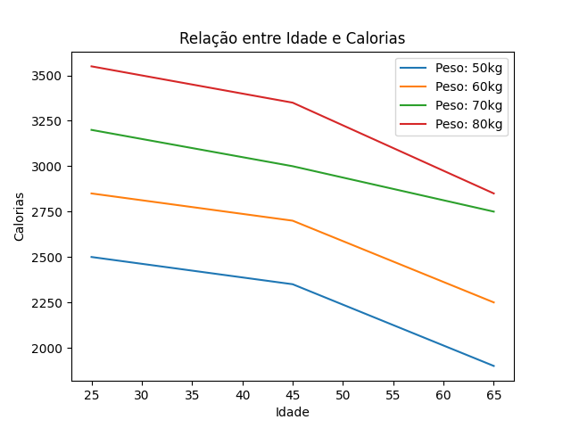
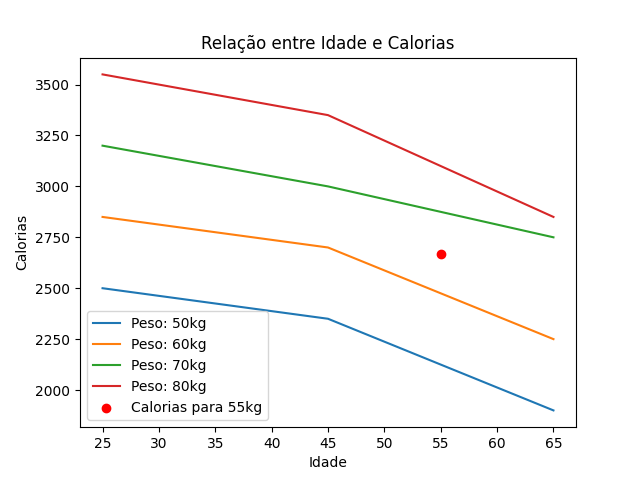

# Dieta do Gabriel

- [Problema](#problema)
    - [Entrada](#entrada)
    - [Saída](#saída)
- [Exemplos](#exemplos)
- [Instruções](#instruções)
- [Resolução](#resolução)
- [Solucão Completa](#solução-completa)

## Problema

Gabriel realiza atividade físicas moderada sempre a uma temperatura ambiente. Como ele não quer realizar atividades físicas mais intensa, ele quer mudar a sua dieta.

Gabriel encontrou a tabela abaixo relaciona a quantidade ideal de calorias em função da idade e do peso para homens que realizam atividade física moderada a uma temperatura ambiente.

| $\begin{matrix}   & idade \\  peso &  \\ \end{matrix}$ | 25 | 45 | 65 |
|:---:|:---:|:---:|:---:|
| **50** | 2500 | 2350 | 1900 |
| **60** | 2850 | 2700 | 2250 |
| **70** | 3200 | 3000 | 2750 |
| **80** | 3550 | 3350 | 2850 |

Agora, Gabriel precisa de sua ajuda usando uma interpolação quadrática dupla, ele precisa determinar a cota aproximada de calorias para um homem de N anos que pesa M kg.

## Entrada

A entrada possui dois inteiros $N$ e $M$ separados por um espaço:     
- $( 25 <= N <= 65 )$ 
- $( 50 <= M <= 70)$

## Saída

Imprima um número ponto flutuante com `5` casas decimais depois da vírgula representando a cota aproximada de calorias para um homem de $N$ anos que pesa $M kg$.

## Exemplos

Entrada

    30 55

Saída

    2670.11719

## Instruções

Aparentemente, a ordem das interpolações pode afetar o valor do resultado. Os resultados foram calculados encontrando primeiro a cota aproximada de calorias para um homem com peso M e depois foi calculado para a idade N.

## Resolução

Vamos começar fazendo uma visualização da tabela de calorias:

```python
import matplotlib.pyplot as plt
import numpy as np

peso = [50, 60, 70, 80]
idade = [25, 45, 65]

calorias = [[2500, 2350, 1900],
            [2850, 2700, 2250],
            [3200, 3000, 2750],
            [3550, 3350, 2850]]

# Converter as listas em um array numpy
idade_arr = np.array(idade)
calorias_arr = np.array(calorias)

# Criar um gráfico de linha para cada valor de peso
for i, p in enumerate(peso):
    plt.plot(idade_arr, calorias_arr[i], label=f'Peso: {p}kg')

# Configurar os rótulos dos eixos e o título do gráfico
plt.xlabel('Idade')
plt.ylabel('Calorias')
plt.title('Relação entre Idade e Calorias')
plt.legend()

# Exibir o gráfico
plt.show()


# Criar um gráfico de linha para cada valor de idade
plt.plot(peso, idade, calorias)

plt.show()
```



Para resolver esse problema, vamos fazer uma interpolação com o método de lagrange. Para isso, vamos criar uma função que calcula o produto de todos os elementos de uma lista:
    
```python
def prod(lista):
    # Inicializar o resultado com 1
    resultado = 1
    # Para cada elemento da lista, multiplicar pelo resultado
    for x in lista:
        resultado *= x
    return resultado
```

Agora, vamos criar uma função que calcula o polinômio de Lagrange para um valor de $i$ e um valor de $x$:

```python
def calcular_L(i, x):
    # Calcular o tamanho da lista
    n = len(x)
    
    # Função que calcula o numerador
    def calcular_num(a):
        # Multiplicar todos os elementos da lista
        return prod([(a - x[j]) for j in range(n) if j != i])

    # Multiplicar todos os elementos da lista
    den = prod([(x[i] - x[j]) for j in range(n) if j != i])
    
    # Retornar uma função que calcula o polinômio de Lagrange
    return lambda a: calcular_num(a) / den
```

Agora, vamos criar uma função que chama a função `calcular_L` para cada valor de $i$ e $x$:

```python
def calcular_PolinomioLagrange(x, y):
    # Verificar se o tamanho das listas são iguais
    if len(x) != len(y):
        raise RuntimeError("Tamanho das listas diferentes")
    else:
        # Calcular o tamanho da lista
        n = len(x)
        # Retornar uma função que calcula o polinômio de Lagrange
        return lambda a: sum([y[i] * calcular_L(i, x)(a) for i in range(n)])
```

Main

```python
def main():
    # Lista de idades
    IDADES = [25, 45, 65] 
    # Lista de pesos
    MASSAS = [50, 60, 70, 80]
    # Lista de calorias
    CALORIAS = [
        [2500, 2350, 1900],  # 50
        [2850, 2700, 2250],  # 60
        [3200, 3000, 2750],  # 70
        [3550, 3350, 2850]   # 80
    ]
    # Ler a idade e o peso
    idade, peso = map(int, input().split())
    # Verificar se o peso é menor que 60
    if abs(peso - MASSAS[1]) <= abs(peso - MASSAS[2]):
        # Se for, pegar os valores de 50 e 60
        pesos = MASSAS[:3]
        calorias = CALORIAS[:3]
    else:
        # Se não for, pegar os valores de 60 e 70
        pesos = MASSAS[1:]
        calorias = CALORIAS[1:]

    # Lista de polinômios de Lagrange
    polinomios_idades = []
    
    # Para cada valor de caloria, calcular o polinômio de Lagrange para a idade e adicionar na lista
    for caloria in calorias:
        polinomios_idades.append(calcular_PolinomioLagrange(IDADES, caloria)(idade))

    # Calcular o polinômio de Lagrange para o peso
    polinomio_peso = calcular_PolinomioLagrange(pesos, polinomios_idades)(peso)

    # Imprimir o resultado
    print("%.5f" % polinomio_peso)


if __name__ == '__main__':
    main()
```

Utilizando o método de Lagrange, podemos achar o polinômio que melhor se ajusta aos dados.
Por exemplo, para uma pessoa de 30 anos e 55kg, a caloria necessária é de 2670.11719.

```python
import matplotlib.pyplot as plt
import numpy as np

peso = [50, 60, 70, 80]
idade = [25, 45, 65]

calorias = [[2500, 2350, 1900],
            [2850, 2700, 2250],
            [3200, 3000, 2750],
            [3550, 3350, 2850]]

# Converter as listas em um array numpy
idade_arr = np.array(idade)
calorias_arr = np.array(calorias)

# Criar um gráfico de linha para cada valor de peso
for i, p in enumerate(peso):
    plt.plot(idade_arr, calorias_arr[i], label=f'Peso: {p}kg')

# Marcando o ponto (55, 2670.11719)
plt.scatter(55, 2670.11719, color='red', label='Calorias para 55kg')

# Configurar os rótulos dos eixos e o título do gráfico
plt.xlabel('Idade')
plt.ylabel('Calorias')
plt.title('Relação entre Idade e Calorias')
plt.legend()

# Exibir o gráfico
plt.show()
```


## Solução Completa

```python
def prod(lista):
    resultado = 1
    for x in lista:
        resultado *= x
    return resultado
    
def calcular_L(i, x):
    n = len(x)
    
    def calcular_num(a):
        return prod([(a - x[j]) for j in range(n) if j != i])
    
    den = prod([(x[i] - x[j]) for j in range(n) if j != i])
    
    return lambda a: calcular_num(a) / den
     
def calcular_PolinomioLagrange(x, y):
    if len(x) != len(y):
        raise RuntimeError("Tamanho das listas diferentes")
    else:
        n = len(x)
        return lambda a: sum([y[i] * calcular_L(i, x)(a) for i in range(n)])


def main():

    IDADES = [25, 45, 65] 

    MASSAS = [50, 60, 70, 80]

    CALORIAS = [
        [2500, 2350, 1900],  # 50
        [2850, 2700, 2250],  # 60
        [3200, 3000, 2750],  # 70
        [3550, 3350, 2850]   # 80
    ]

    idade, peso = map(int, input().split())

    if abs(peso - MASSAS[1]) <= abs(peso - MASSAS[2]):
        pesos = MASSAS[:3]
        calorias = CALORIAS[:3]
    else:
        pesos = MASSAS[1:]
        calorias = CALORIAS[1:]

    polinomios_idades = []
    
    for caloria in calorias:
        polinomios_idades.append(calcular_PolinomioLagrange(IDADES, caloria)(idade))

    polinomio_peso = calcular_PolinomioLagrange(pesos, polinomios_idades)(peso)

    print("%.5f" % polinomio_peso)


if __name__ == '__main__':
    main()
```