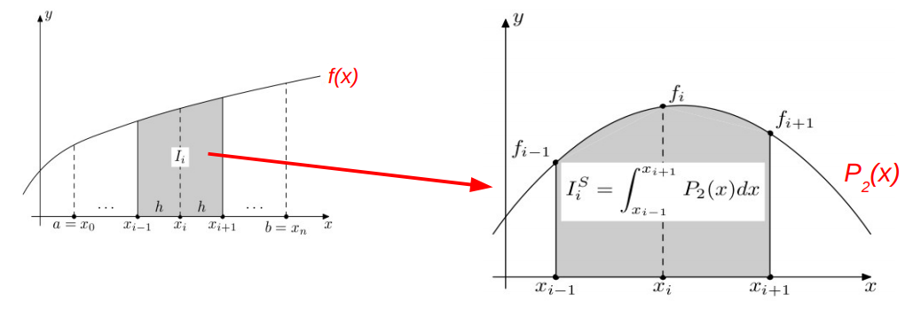

# Método de Simpson 1/3

- [Método de Simpson 1/3](#método-de-simpson-13)
- [Descrição](#descrição)
- [Exemplos](#exemplos)
- [Solução](#solução)

## Descrição

O método de Simpson 1/3 consiste em aproximar a função $f(x)$  no intervalo  $[x_{i-1}, x_{i+1}]$  pelo polinômio interpolador de grau 2 que passa pelos pontos  

$$
(x_{i-1}, f(x_{i-1})), (x_i, f(x_i))   e  (x_{i+1}, f(x_{i+1}))
$$ 

<div align="center">
    
</div>

Usando o polinômio interpolador de grau 2, obtemos a  seguinte aproximação

$$
\int_{x_{i-1}}^{x_{i+1}} f(x) dx = \frac{h}{3}[ f_{i-1} + 4f_i + f_{i+1}
]$$

onde 

 $$h = (x_{i+1} - x_{i-1})/2 $$


A regra de simpson composta consiste em dividir o intervalo em N subintervalos e aplicar a regra de simpson em cada subintervalo.

Dado um função polinomial $f(x)$, sua tarefa é calcular a integral $f(x)$ no intervalo $[A,B]$ usando a regra de simpson composta realizando a divisão em N intervalos.

## Entrada

A entrada possui três linhas. A primeira linha contém um inteiro $D$ representando o grau do polinômio dado.

A segunda linha possui $D+1$ inteiros  $a_0, \ldots , a_{D}$  representando os coeficientes do polinômio dado tal que 

$$P(x) = a_0 + a_1 x + a_2 x^2 + \ldots + a_D x^D$$ 

A terceira linha possui três inteiros $A$, $B$ e $N$ sendo que $[A,B]$ representa o intervalo de integração e N representa a quantidade de subintervalos da regra de simpson composta.


## Saída

Imprima um número ponto flutuante com cinco casas decimais depois da vírgula representando o valor aproximado da integral calculada usando a regra de simpson composta.

## Exemplos

**Entrada**
```
4
3 2 1 2 1
0 1 1
```

**Saída**
```
5.04167
```
---

**Entrada**
```
4
3 2 1 2 1
0 1 2
```

**Saída**
```
5.03385
```

## Solução

```python

def polinimio(n, grau, COEFICIENTES):
    return sum([COEFICIENTES[i]*n**i for i in range(0, grau+1)])

def simpson(INTERVALO_INICIAL, INTERVALO_FINAL, GRAU, COEFICIENTES):

    TAMANHO_DO_INTERVALO = (INTERVALO_FINAL - INTERVALO_INICIAL)/2

    f0 = polinimio(INTERVALO_INICIAL, GRAU, COEFICIENTES)

    f1 = polinimio(INTERVALO_INICIAL + TAMANHO_DO_INTERVALO, GRAU, COEFICIENTES)

    f2 = polinimio(INTERVALO_FINAL, GRAU, COEFICIENTES)

    return (TAMANHO_DO_INTERVALO / 3) * (f0 + 4 * f1 + f2)

def simpson_composto(INTERVALO_INICIAL, INTERVALO_FINAL, DISCRETIZACAO, GRAU, COEFICIENTES):
    
    soma = 0

    TAMANHO_DO_INTERVALO = (INTERVALO_FINAL - INTERVALO_INICIAL)/DISCRETIZACAO

    for i in range(DISCRETIZACAO):
        soma += simpson(INTERVALO_INICIAL + (i * TAMANHO_DO_INTERVALO), INTERVALO_INICIAL + (i + 1) * TAMANHO_DO_INTERVALO, GRAU, COEFICIENTES)

    return soma

def main():

    GRAU = int(input())

    COEFICIENTES = list(map(float, input().split()))
    COEFICIENTES.reverse()

    INTER_DE_INTEGRACAO_E_DISCRET = list(map(int, input().split()))

    VALUE = simpson_composto(INTER_DE_INTEGRACAO_E_DISCRET[0], INTER_DE_INTEGRACAO_E_DISCRET[1], INTER_DE_INTEGRACAO_E_DISCRET[2], GRAU, COEFICIENTES)

    print("%.5f" % VALUE)

if __name__ == '__main__':
    main()
```

- A função `polinimio` é responsável por calcular o valor do polinômio para um determinado valor de `n`. Ela recebe três parâmetros: 
    - `n` que é o valor para o qual o polinômio será calculado; 
    - `grau`, que é o grau do polinômio; 
    - `COEFICIENTES`, que é uma lista com os coeficientes do polinômio.
    
    A função retorna o valor do polinômio para o valor de n passado como parâmetro.
---
- A função `simpson` é responsável por calcular a integral de um polinômio usando a regra de Simpson. Ela recebe quatro parâmetros: 
    - `INTERVALO_INICIAL`, que é o limite inferior do intervalo de integração; 
    - `INTERVALO_FINAL`, que é o limite superior do intervalo de integração; 
    - `GRAU`, que é o grau do polinômio; 
    - `COEFICIENTES`, que é uma lista com os coeficientes do polinômio. 
    
    A função retorna o valor da integral calculada usando a regra de Simpson.
---
- A função `simpson_composto` é responsável por calcular a integral de um polinômio usando a regra de Simpson composta. Ela recebe cinco parâmetros: 
    - `INTERVALO_INICIAL`, que é o limite inferior do intervalo de integração; 
    - `INTERVALO_FINAL`, que é o limite superior do intervalo de integração; 
    - `DISCRETIZACAO`, que é o número de subintervalos em que o intervalo de integração será dividido; 
    - `GRAU``,que é o grau do polinômio; 
    - `COEFICIENTES`, que é uma lista com os coeficientes do polinômio. A função retorna o valor da integral calculada usando a regra de Simpson composta.
---
- A função main é responsável por executar todo o programa. Ela lê os valores de entrada, chama a função simpson_composto para calcular a integral e imprime o resultado na tela.