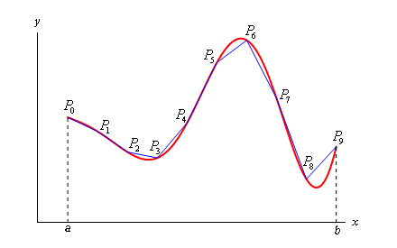

# Problema do comprimento de um arco

- [Descrição](#descrição)
- [Entrada](#entrada)
- [Saída](#saída)
- [Solução](#solução)
    - [Explicação](#explicação)
- [Solução 2](#solução-2-utilizando-a-biblioteca-sympy)


## Descrição
Nós queremos determinar o comprimento de uma função $y = f(x)$ em um intervalo $[a,b]$. 

Inicialmente, vamos estimar o comprimento da curva, dividindo o intervalo em $n$ subintervalos cada com largura $\Delta x$ e vamos denotar o ponto na curva em cada ponto por $P_i$. Podemos então aproximar a curva por uma série de linhas retas conectando os pontos.

<div align="center">
    
</div>

Agora podemos denotar o comprimento de cada um dos segementos de linhas pela distâncias entre os pontos $P_{i-1}$ e $P_i$. Logo, o comprimento $L$ da curva será:

$$L = \sum_{i=1}^{n} dist(P_{i-1}, P_i)$$

Em cada segmento, vamos definir $\Delta y_i = y_i - y_{i-1} = f(x_i) - f(x_{i-1})$. O comprimento de cada segmento será:

$$dist(P_{i-1}, P(i)) = \sqrt{(x_i - x_{i-1})^2 +  (y_i - y_{i-1})^2} = \sqrt{ \Delta x_i^2 + \Delta y_i^2}$$

Pelo Teorema do Valor Médio, sabemos que existe um ponto $x_i^* \in [x_{i-1},_i]$ tal que

$$
\begin{align*}
f(x_i) - f(x_{i-1}) & = & f'(x_i^*)(x_i - x_{i-1})\\
\Delta y_i & = & f'(x_i^*) \Delta x
\end{align*}
$$

Portanto, o comprimento da curva será escrito como:

$$
\begin{align*}
dist(P_{i-1},P_i) & = & \sqrt{(x_i - x_{i-1})^2 +  (y_i - y_{i-1})^2}\\
& = & \sqrt{(\Delta x)^2 +  (\Delta y_i)^2}\\
& = & \sqrt{\Delta x^2 +  f'(x_i*) \Delta x^2}\\
& = & \sqrt{\Delta x^2 [ 1 +  f'(x_i*)] }\\
& = & \Delta x \sqrt{ [ 1 +  f'(x_i*)] }\\
\end{align*}
$$

O comprimento exato da curva será:

$$
\begin{align*}
L  & = & \lim_{n \gets \infty} \sum_{i=1}^{n} dist(P_{i-1},P_i)\\
& = & \lim_{n \gets \infty} \sum_{i=1}^{n} \Delta x\sqrt{1 + f'(x_i)}\\
\end{align*}
$$

Usando a definição de integral:

$$L = \int_{a}^{b} \sqrt{1 + f'(x_i)} dx$$

Por exemplo, seja $f(x) = x^2$. Calcule o comprimento do arco da função $f(x)$ no intervalo entre $(1,3)$

A função $f'(x) = 2x$, então $[f'(x)]^2 = 4x^2$. Portanto, o comprimento do arco será:

$$L = \int_{1}^{3} \sqrt{1 + 4x^2} \approx 8.26815$$


## Entrada

A entrada possui três linhas. A primeira linha contém um inteiro $n$ representando o grau do polinômio dado. A segunda linha $n+1$ inteiros representando  $a_n,a_{n-1},\ldots,a_0$  representando os coeficientes do grau do polinômio dado tal que  

$$P(x) = a_nx^n + a_{n-1}x^{n-1}+ \ldots + a_1x + a_0$$ 

A terceira linha contém dois inteiros a e b representando os limites do intervalo.

Utilize como tolerância $0.000001$.

## Saída

Devolva um número ponto com 5 casas decimais representando o comprimento da curva $f(x)$ no intervalo entre $[a,b]$


Entrada
```
2
1 0 0
1 3
```

Saída 
```
8.26815
``` 

Entrada
```
2
1 2 3
```

Saída 
```
12.17185
``` 

## Solução

```python
def polinomio(n, grau, coeficientes) -> float:
    """
    Retorna o valor do polinômio no ponto n.

    Args:
        n (float): Valor de entrada.
        grau (int): Grau do polinômio.
        coeficientes (list): Lista de coeficientes do polinômio.

    Returns:
        float: Valor do polinômio no ponto n.
    """
    return sum(coeficientes[i] * (grau - i) * (n ** (grau - i - 1)) for i in range(grau + 1))

def comprimento_curva(grau, coeficientes, a, b) -> float:
    """
    Calcula o comprimento de uma curva definida por um polinômio.

    Args:
        grau (int): Grau do polinômio.
        coeficientes (list): Lista de coeficientes do polinômio.
        a (float): Limite inferior de integração.
        b (float): Limite superior de integração.

    Returns:
        float: Comprimento da curva.
    """
    def integrando(x) -> float:
        return (1 + polinomio(x, grau, coeficientes) ** 2) ** 0.5

    def trapezoidal(g, a, b) -> float:
        h = b - a
        return ((g(a) + g(b)) * h) / 2.0

    def trapezoidal_quad(g, a, b, eps) -> float:
        mid = (a + b) / 2.0
        tot = trapezoidal(g, a, b)

        if abs(trapezoidal(g, a, mid) + trapezoidal(g, mid, b) - tot) > eps:
            return trapezoidal_quad(g, a, mid, eps / 2.0) + trapezoidal_quad(g, mid, b, eps / 2.0)
        else:
            return tot

    return trapezoidal_quad(integrando, a, b, 1e-7)

def main():
    GRAU = int(input())

    COEFICIENTES = list(map(int, input().split()))

    PONTOS = list(map(int, input().split()))

    VALUE = comprimento_curva(GRAU, COEFICIENTES, PONTOS[0], PONTOS[1])

    print('{:.5f}'.format(VALUE))

if __name__ == '__main__':
    main()
```

## Explicação:

1. A função `polinomio(n, grau, coeficientes)` calcula o valor do polinômio de grau `grau` com coeficientes `coeficientes` no ponto `n`. O cálculo é feito utilizando a fórmula de um polinômio, onde cada termo é multiplicado pelo valor do ponto elevado ao seu respectivo grau e coeficiente. A função retorna o valor do polinômio no ponto n.

2. A função `comprimento_curva(grau, coeficientes, a, b)` calcula o comprimento de uma curva definida pelo polinômio de grau `grau` e coeficientes `coeficientes` entre os limites de integração `a` e `b`. Para calcular o comprimento, a função utiliza o método numérico dos trapézios. Ela define funções auxiliares `integrando(x)`, `trapezoidal(g, a, b)`, e `trapezoidal_quad(g, a, b, eps)` para realizar os cálculos.

3. A função `integrando(x)` calcula o valor da função integrando utilizada no método dos trapézios. Ela utiliza a função `polinomio(x, grau, coeficientes)` para obter o valor do polinômio no ponto `x`, eleva esse valor ao quadrado, soma 1 e calcula a raiz quadrada.

4. A função `trapezoidal(g, a, b)` calcula a área de um trapézio entre os pontos `a` e `b`, utilizando a função `g(x)` para obter os valores da função no intervalo.

5. A função `trapezoidal_quad(g, a, b, eps)` é uma função recursiva que utiliza o método dos trapézios para calcular numericamente a integral da função `g(x)` entre os pontos `a` e `b`. Ela divide o intervalo ao meio, calcula a área dos dois trapézios resultantes e verifica se a diferença entre a soma das áreas dos trapézios e o valor total é menor que a precisão `eps`. Se não for, ela chama recursivamente a função para os dois subintervalos até atingir a precisão desejada.

6. A função `main()` é a função principal do programa. Ela solicita ao usuário o grau do polinômio, os coeficientes do polinômio e os limites de integração. Em seguida, chama a função `comprimento_curva(GRAU, COEFICIENTES, PONTOS[0], PONTOS[1])` para calcular o comprimento da curva e imprime o valor formatado com cinco casas decimais.

7. Por fim, a função `main()` é executada se o código for executado diretamente, não importado como um módulo.


## Solução 2 (utilizando a biblioteca `sympy`)

```python
import numpy as np
import scipy.integrate as spi

def f(x):
    return x**2

def df(x):
    return 2*x

def comprimento_arco(f, a, b):
    integrando = lambda x: np.sqrt(1 + (df(x))**2)
    return spi.quad(integrando, a, b)

a = 1
b = 3
L = comprimento_arco(f, a, b)[0]

print("%.5f" % L)
```