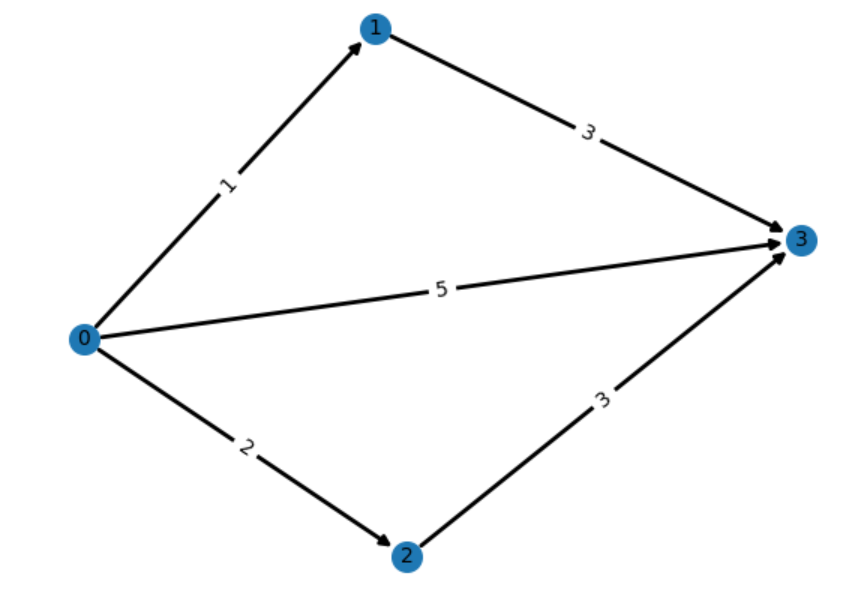

# Caminho Mínimo

- [Descrição](#descrição)
- [Modelagem](#modelagem)
  - [Variáveis](#variáveis)
  - [Modelo](#modelo)
- [Modelo de Programação Linear](#modelo-de-programação-linear)
- [Entrada](#entrada)
- [Exemplos](#exemplos)
  - [Entrada](#entrada-1)
  - [Saída](#saída)


## Descrição:

Dado um grafo direcionado ponderado com $n$ vértices e $m$ arestas com os pesos de todas arestas não-negativos. Você recebe também um vértice de origem $s$ e um vértice de destino $t$, queremos encontrar o caminho mínimo de $s$ para $t$.

Considere o grafo abaixo:

<div align="center">
    
</div>

Vamos considerar que o vértice de origem, denotado por $s$, será o vértice 0 e o vértice de destino, denotado por $t$, será o vértice 3.

Analisando temos três caminhos de 0 para 3:

- 0 -> 1 -> 3 com custo 4.
- 0 -> 3 com custo 5
- 0 -> 2 -> 3 com custo 5

O caminho com o menor custo será o caminho com custo 4.

## Modelagem

Na modelagem, teremos uma variável para cada aresta do nosso grafo.

### Variáveis:

$ 
x_{uv}  \ge 0 | \forall (u,v) \in E(G)
$ 

### Modelo:

Minimize $ \sum_{(u,v) \in E(G)} x_{uv} \cdot w(u, v) = 0 | \forall u \notin s, u \notin t $

Sujeito a:

$$
\begin{align}
\text{Minimize} \quad & \sum_{(u,v) \in E(G)} x_{uv} \cdot w(u, v) = 0 | \forall u \notin s, u \notin t \\

\text{Sujeito a} \quad & \sum_{v \in out(u)} x_{uv} - \sum_{v \in in(u)} x_{vu} = 0, \quad \forall u \neq s, u \neq t \\

& \sum_{v \in out(u)} x_{uv} - \sum_{v \in in(u)} x_{vu} = 1, \quad \forall u = s \\

& \sum_{v \in out(u)} x_{uv} - \sum_{v \in in(u)} x_{vu} = -1, \quad \forall u = t \\

& x_{uv} \ge 0, \quad \forall (u,v) \in E(G)

\end{align}
$$

A intuição por trás desse LP é a seguinte: O valor da variável $x_{u,v}$ é a quantidade de tráfego na aresta $(u,v)$. A primeira restrição diz todo fluxo que sai de $u$ menos todo o fluxo que entra em $u$ deve ser igual a zero se $u \neq s$ e $u \neq t$, ou seja, o fluxo é conservado. A segunda restrição diz todo fluxo que sai de $u$ menos todo o fluxo que entra em $u$ deve ser igual a 1 se $u = s$ , ou seja, estamos enviando uma unidade de fluxo a partir de $s$. A terceira restrição diz todo fluxo que sai de $u$ menos todo o fluxo que entra em $u$ deve ser igual a -1 se $u=t$ , ou seja, $t$ está recebendo uma unidade de fluxo a partir de $s$.

Se pensarmos em $w(u,v)$ como o custo por unidade de tráfego que segue $e$, $x(u,v) \cdot w(u,x)$ é o custo de enviando este fluxo de $e$ para $t$. Então, estamos tentando minimizar o custo de uma unidade de fluxo de $s$ para $t$. O custo mínimo é o peso de um caminho $s \rightarrow  t$ mais curto.

## Modelo de Programação Linear

Para o exemplo do grafo, temos o seguinte modelo:

minimize x0,1+5x0,3+2x0,2+3x1,3+3x2,3

sujeito a

$x1,3−x0,1=0$

$x2,3−x0,2=0$

$x0,1+x0,3+x0,2=1$

$−x1,3−x0,3−x2,3=−1$

$x0,1,x1,3,x0,3,x0,2,x2,3≥0$

Sua tarefa é dada um grafo direcionado de entrada com o vertice de origem e destino, imprima o custo do caminho mínimo e os valores das variáveis associadas as arestas na ordem que elas foram dadas na entrada.

## Entrada

A primeira linha da entrada é composta por quatro inteiros n , n , s e t representando o número de vértices e o número de arestas, o vértice inicial e o vértice final, respectivamente.

As seguintes M linhas possui três inteiros: u, v, w representando a ponta inicial, a ponta final da aresta e o peso do aresta.

# Exemplos

## Entrada

    4 5 0 3
    0 1 1
    1 3 3
    0 3 5
    0 2 2
    2 3 3

## Saída

    Solution: 
    Objective value = 4.0
    x[0,1] = 1.0
    x[1,3] = 1.0
    x[0,3] = 0.0
    x[0,2] = 0.0
    x[2,3] = 0.0

## Código de apoio

```python


from ortools.linear_solver import pywraplp

# get solver 
solver = pywraplp.Solver.CreateSolver('GLOP')

edges = [(0,1,1),(1,3,3),(0,3,5),(0,2,2),(2,3,3)]
peso = {(0,1):1, (1,3):3, (0,3): 5, (0,2): 2, (2,3):3}
# declare decision variables
x = {}
x[0,1] = solver.NumVar(0.0, 1.0, 'x{}'.format((0,1)))
x[1,3] = solver.NumVar(0.0, 1.0, 'x{}'.format((1,3)))
x[0,3] = solver.NumVar(0.0, 1.0, 'x{}'.format((0,3)))
x[0,2] = solver.NumVar(0.0, 1.0, 'x{}'.format((0,2)))
x[2,3] = solver.NumVar(0.0, 1.0, 'x{}'.format((2,3)))


# declare objective
c = 0
c += x[0,1]*peso[0,1]
c += x[1,3]*peso[1,3]
c += x[0,3]*peso[0,3]
c += x[0,2]*peso[0,2]
c += x[2,3]*peso[2,3]


solver.Minimize(c)

# # declare constraints


solver.Add( x[1,3] - x[0,1] == 0)
solver.Add( x[2,3] - x[0,2] == 0)
solver.Add( x[0,1] + x[0,3] + x[0,2]== 1)
solver.Add( -x[1,3] - x[0,3] - x[2,3] == -1)


#Imprimir o modelo
#print('\nModel:\n')
#print(solver.ExportModelAsLpFormat(True))


# # solve
results = solver.Solve()

# print results
if results == pywraplp.Solver.OPTIMAL:
    print('Solution:')
    print('Objective value =', solver.Objective().Value())

    for (u,v,w) in edges:
      print("x[{},{}] = {}".format(u, v, x[u,v].solution_value()))
    
else:
    print('The problem does not have an optimal solution.')

```

## Solução

```python
from ortools.linear_solver import pywraplp


def encontrar_caminho_minimo(num_vertices, num_arestas, vertice_inicial, vertice_final, arestas):
    solver = pywraplp.Solver.CreateSolver('GLOP')

    x = {}
    for (u, v, w) in arestas:
        x[u, v] = solver.BoolVar('x[{}, {}]'.format(u, v))

    # Adiciona o objetivo
    objetivo = solver.Objective()
    for (u, v, w) in arestas:
        objetivo.SetCoefficient(x[u, v], w)
    objetivo.SetMinimization()

    # Adiciona as restrições
    for u in range(num_vertices):
        soma_saida = solver.Sum(x[u, v] for (i, v, _) in arestas if i == u)
        soma_entrada = solver.Sum(x[i, u] for (i, v, _) in arestas if v == u)
        if u == vertice_inicial:
            solver.Add(soma_saida - soma_entrada == 1)
        elif u == vertice_final:
            solver.Add(soma_saida - soma_entrada == -1)
        else:
            solver.Add(soma_saida - soma_entrada == 0)

    # Resolve o problema
    results = solver.Solve()

    # Retorna os resultados
    if results == pywraplp.Solver.OPTIMAL:
        valor_objetivo = objetivo.Value()
        caminho_minimo = [(u, v, x[u, v].solution_value()) for (u, v, _) in arestas]
        return valor_objetivo, caminho_minimo
    else:
        return None, None


def main():
    num_vertices, num_arestas, vertice_inicial, vertice_final = map(int, input().split())

    arestas = []
    for _ in range(num_arestas):
        vertice_origem, vertice_destino, peso_aresta = map(int, input().split())
        arestas.append((vertice_origem, vertice_destino, peso_aresta))

    valor_objetivo, caminho_minimo = encontrar_caminho_minimo(num_vertices, num_arestas, vertice_inicial, vertice_final, arestas)

    if valor_objetivo is not None and caminho_minimo is not None:
        print('Solução:')
        print('Valor objetivo =', valor_objetivo)
        for (u, v, valor) in caminho_minimo:
            print("x[{}, {}] = {}".format(u, v, valor))
    else:
        print('O problema não possui uma solução ótima.')


if __name__ == '__main__':
    main()
```

## Explicação

1. A importação `from ortools.linear_solver import pywraplp` traz a biblioteca necessária para resolver problemas de programação linear usando o OR-Tools.

2. A função `encontrar_caminho_minimo` é responsável por resolver o problema do caminho mínimo. Ela recebe como argumentos o número de vértices (`num_vertices`), o número de arestas (`num_arestas`), o vértice inicial (`vertice_inicial`), o vértice final (`vertice_final`) e a lista de arestas (`arestas`).

3. Dentro da função, é criado um solver (`solver`) usando o método `pywraplp.Solver.CreateSolver('GLOP')`, que define o solver para o problema de programação linear.

4. É criado um dicionário `x` para representar as variáveis de decisão `x[u, v]`, que indicam se a aresta (u, v) pertence ao caminho mínimo. As variáveis são do tipo booleano (`BoolVar`).

5. Em seguida, é adicionado o objetivo ao solver utilizando o método `solver.Objective()`. O objetivo é minimizar a soma dos pesos das arestas do caminho mínimo. Os coeficientes das variáveis de decisão são definidos usando `objetivo.SetCoefficient(x[u, v], w)`, onde `w` é o peso da aresta (u, v).

6. As restrições são adicionadas ao solver. Para cada vértice `u`, são criadas restrições para garantir que a quantidade de arestas de saída seja igual à quantidade de arestas de entrada. A variável `soma_saida` representa a soma das variáveis `x[u, v]` para todas as arestas que saem de `u`, e `soma_entrada` representa a soma das variáveis `x[u, v]` para todas as arestas que chegam em `u`. As restrições são adicionadas ao solver usando o método `solver.Add()`.

7. O solver é usado para resolver o problema através do método `solver.Solve()`, que retorna o status da solução.

8. Os resultados são retornados pela função `encontrar_caminho_minimo`. Se a solução ótima é encontrada (o status é `pywraplp.Solver.OPTIMAL`), o valor objetivo e o caminho mínimo são extraídos e retornados.

9. A função `main()` é responsável por receber a entrada do usuário, chamar a função `encontrar_caminho_minimo` e exibir os resultados.

10. Na função `main()`, os valores de entrada são lidos através de `input().split()` e convertidos para inteiros usando `map(int, ...)`. O número de vértices, o número de arestas, o vértice inicial e o vértice final são atribuídos às variáveis correspondentes.

11. A lista `arestas` é inicializada vazia. Em um loop, os valores de entrada são lidos e cada aresta é adicionada à lista `arestas`.

12. A função `encontrar_caminho_minimo` é chamada com os parâmetros adequados, e os resultados são armazenados em `valor_objetivo` e `caminho_minimo`.

13. Se a solução ótima existe, os resultados são exibidos na tela. Caso contrário,

 é exibida uma mensagem informando que o problema não possui uma solução ótima.
